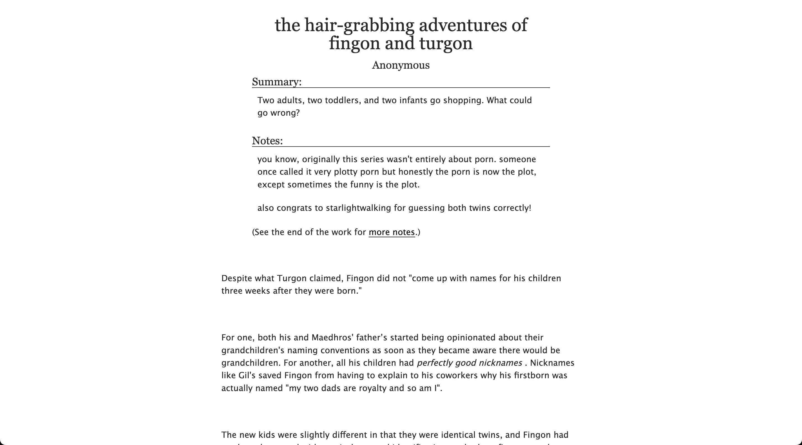
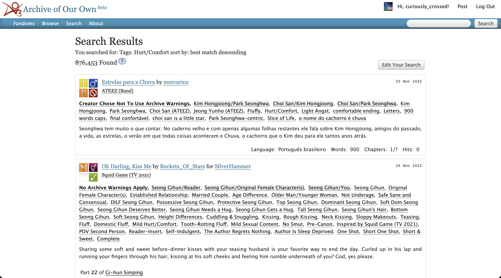
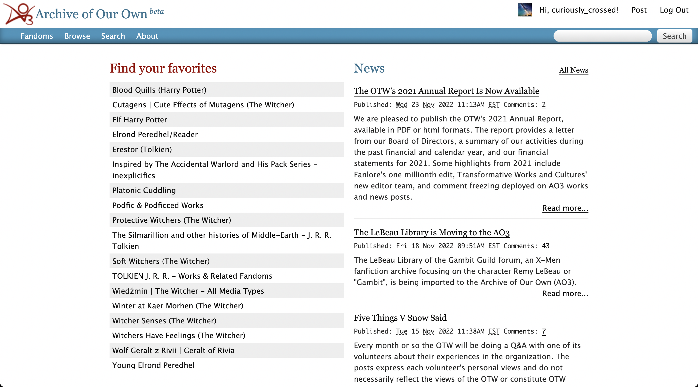

# Easier Reading: Narrow content on screen for search and workskins

CSS content to use for an AO3 skin. To use for your own site skin, go to "create a skin" and copy and paste the css. This is intended for a site skin, not a work skin.

Narrow the reading field for a larger screen. This will narrow the content in search results and workskins for a larger screen. Use the snow blue theme for color. Intended for ease of reading and comfort to prevent having to move your eyes overmuch. Showing "the hair-grabbing adventures of fingon and turgon" by Anonymous as an example.

You can edit the amount of padding by increasing or decreasing the percentage in the CSS.

### Photos:
##### Work Example

##### Search Example

##### Home Example

